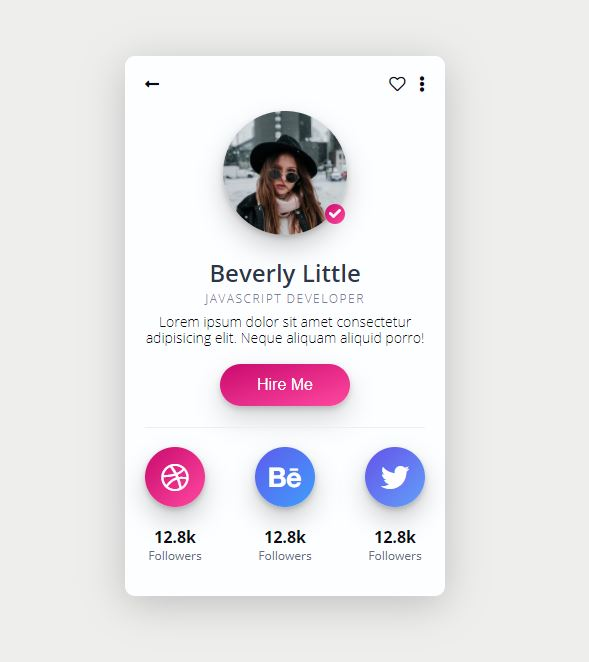
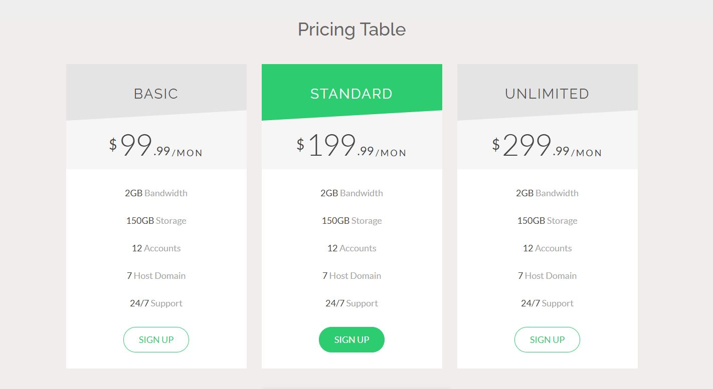
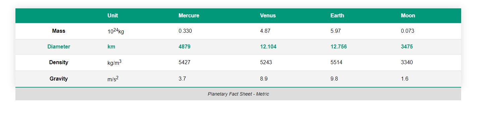

## TP 4 : Carte de profil, grille tarifaire et tableaux de métriques planétaires

### Exercice 1 : Carte de profil

Dans cet exercice, vous devez reproduire à l'identique le screen fourni en pièce jointe. 

Voici quelques indications : 
- Couleurs :
    - Le background de la page doit avoir la couleur #eeeeec et la carte blanche.

    - Libre d'aporter la couleur de votre choix sur les icones et le bouton sauf que vous devez avoir un dégradé de couleur pour chaque.

- Images et îcones :
    - Libre de mettre la photo de profil de votre choix 

    - Utiliser les îcones de la librairie font-awesome

- Couleur des textes : 
    - Beverly Little : #2D354A
    - Javascript developer : #7C8097
    - Lorem.... : #080911

Correction : https://techmindconsulting.github.io/workshop-css/tp-4/

### Exercice 2 : Reproduire la liste des différents prix proposés

Dans cet exercice, vous devez reproduire à l'identique le screen fourni en pièce jointe. 

Voici quelques indications : 
- Code couleur: 
    - Background de la page: #F0EDED
    - Background titre (gris): #E4E4E4
    - Background Titre au survol (vert) : #2ECC71 
    - Bouton (vert) : #2ECC71 
    - Couleur texte des caractéristiques technique (gris clair) : #A7A7A7
    - Blanc : #ffffff
    - Noir: #000000
    - Gris: #A9A9A9

- Police de caractère: Raleway ou Lato et sans-serif

Correction : https://techmindconsulting.github.io/workshop-css/tp-4/

### Exercice 3 : Reproduire le tableau

Dans cet exercice, vous devez reproduire à l'identique le screen fourni en pièce jointe. 

Correction : https://techmindconsulting.github.io/workshop-css/tp-4/

Voici quelques indications : 
- Code couleur: 
    - Couleur en-tête :  #009879;
    - Background de la ligne 1 fois sur deux : #f3f3f3
    - Background de la légende : #dddddd
    - Pour la ligne dont le texte est en vert, définissez une fois afin d'appliquer la couleur #009879
- Police de caractère: Raleway ou Lato et sans-serif
