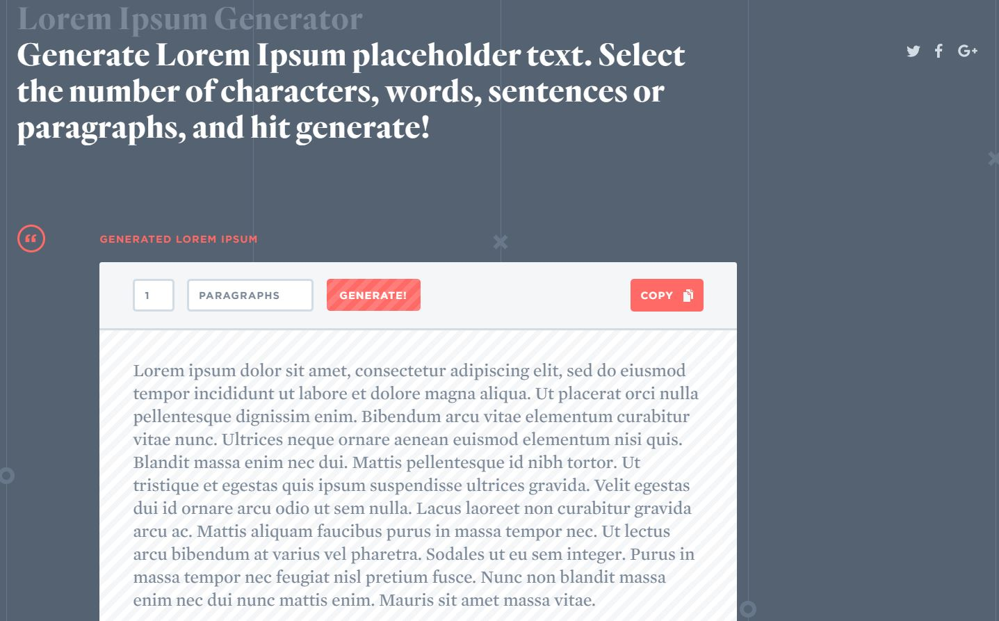

## TP 5 : Mise en page avec flexbox

### Exercice

Reproduire à l'identique la maquette suivante en utilisant le module CSS flexbox: 


Quelques outils en ligne pour générer votre contenu

#### Générateur d'image
- https://picsum.photos: outil en ligne de génération d'images

Exemple 1 : Je veux générer une image de 600 pixels de largeur et 100 pixels de hauteur

```

```


Exemple 2 : Je veux générer une image de 300 pixels de largeur et hauteur

```

```


#### Générateur de texte

- https://loremipsum.io/fr/: outil en ligne de génération de texte (paragraphes, phrases, mots)



